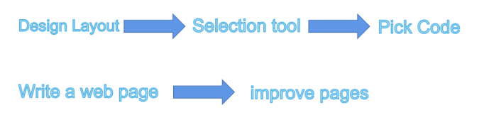
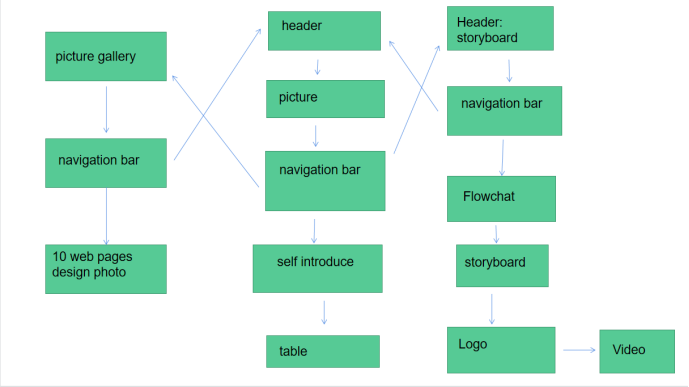

# 452
<!DOCTYPE html>
<html lang="en">
<head>
    <meta charset="UTF-8">
    <meta http-equiv="X-UA-Compatible" content="IE=edge">
    <meta name="viewport" content="width=device-width, initial-scale=1.0">
    <title>Document</title>

        <h1 >My Logo</h1>
        <!--This is logo-->
        <h1 > system</h1>
        
Customer relationship management (CRM) is a technology used to manage all relationships and interactions between companies and customers and potential customers.  The goal is simple: improve business relations to develop your business. CRM system can help companies keep in touch with customers, simplify processes and improve profitability.

        
The importance is as follows:

        <ol>
          <li>CRM can comprehensively improve the operational efficiency of enterprises.</li>
          <li>CRM can enable enterprises to retain old customers and attract new customers.</li>
          <li>Customer relationship management can reduce the cost of enterprises.</li>
          <li>Enterprises can continuously expand market space.</li>
          
        </ol>
            
</body>
</html>
</html>

<a href="https://awen777.github.io/ICT452/index1.html" target="_blank" rel="noopener noreferrer">CV
</a>
<footer style=text-align:center>introduce</footer><!--This is footnote-->

</body>
